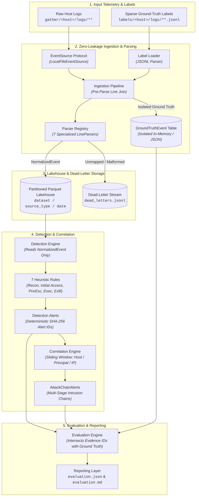

<div align="center">

# TracerLoom

**A log-native detection engineering and evaluation pipeline for multi-source host intrusion telemetry**

[](https://www.python.org/)
[](https://arrow.apache.org/)
[](https://duckdb.org/)
[](https://typer.tiangolo.com/)
[](https://docs.pydantic.dev/)
[](https://astral.sh/ruff)
[](https://mypy-lang.org/)
[](https://docs.pytest.org/)

</div>

---

## Overview

**TracerLoom** is a modular, high-throughput detection engineering and evaluation pipeline. It ingests heterogeneous, raw host logs from distributed enterprise environments, normalizes them into a unified event schema, executes explainable heuristic detection rules, correlates multi-stage attack activity across a kill-chain model, and produces transparent, caveated evaluation metrics against ground-truth datasets.

TracerLoom was developed and benchmarked against the [AIT Log Dataset V2.1](https://zenodo.org/records/5789064) (AIT-LDSv2), specifically the multi-host `russellmitchell` attack scenario.

### Why TracerLoom?

- **Zero Label Leakage**: Ground-truth labels are joined at the raw line level during initial file discovery and preserved in an isolated metadata table. Detection rules operate exclusively on `NormalizedEvent` records and have zero visibility into labels or attack timing.
- **Unified Normalization**: Ingests disparate log formats (Debian/Ubuntu syslog, Apache combined/error, Linux `auditd`, dnsmasq, Metricbeat CPU metrics, OpenVPN) into a single, strongly-typed event schema.
- **Columnar Lakehouse Storage**: Automatically partitions normalized events into Hive-partitioned Apache Parquet datasets (`dataset / source_type / date`) powered by PyArrow and queryable via DuckDB.
- **Explainable Heuristic Detectors**: Implements rule-based behavioral detectors covering five distinct MITRE ATT&CK / cyber kill-chain phases with deterministic SHA-256 evidence linking.
- **Sliding-Window Attack Correlation**: Aggregates disparate host, principal, and network alerts into unified `AttackChainAlert` structures when multi-stage intrusion progressions occur within a configurable time window.
- **Honest Evaluation & Metrics**: Accurately computes detection latency, attack-step recall, alert aggregation ratios, and lower-bound precision without hiding benchmark nuances or sparse-label limitations.

---

## Architecture & Data Flow



---

## Parser Coverage

TracerLoom provides dedicated, battle-tested parsers for seven core system and service log formats:

| Source Type | Target Path / Pattern | Log Format | Key Extracted Fields |
| :--- | :--- | :--- | :--- |
| `auth` | `**/auth.log` | Debian/Ubuntu Syslog | SSH logins, `sudo` commands, `su` session transitions, PAM events |
| `dns` | `**/dnsmasq.log` | dnsmasq Syslog | Query domains, record types (A, AAAA, TXT), client IPs, forwards, replies |
| `vpn` | `**/openvpn.log` | OpenVPN Server Log | Connection handshakes, client IPs, assigned virtual IPs, session resets |
| `web_access` | `**/apache2/*access.log` | Apache Combined Log | HTTP verbs, resource URIs, response codes, client IPs, User-Agents |
| `web_error` | `**/apache2/*error.log` | Apache Error Log | Error levels, client IPs, module names, diagnostic messages |
| `audit` | `**/audit/audit.log` | Linux `auditd` | Syscall events, PAM authentication, process execution (`exe`), `res` |
| `monitoring_cpu` | `**/*system.cpu*.log` | Metricbeat JSON | Per-host timestamped CPU utilization metrics |

> **Dead-Letter Handling**: Any unmapped log sources (e.g., Suricata alerts, mail logs) or malformed lines are safely captured in `.tracerloom-output/dead-letter/dead_letters.jsonl` with line numbers and failure reasons rather than halting the pipeline.

---

## Detection Rules & Attack Stages

Each detector implements the `Detector` protocol, consuming sequences of `NormalizedEvent` objects and emitting structured `Alert` records:

| Rule ID | Kill-Chain Stage | Description & Heuristics |
| :--- | :--- | :--- |
| `web.scanning.high_rate` | **Reconnaissance** | Triggers on high-volume web requests ($\ge 20$ requests) touching $\ge 10$ unique endpoints or exhibiting a $\ge 50\%$ HTTP 404 not-found ratio per `(host, source_ip)`. |
| `web.webshell.command_heuristic` | **Initial Access** | Flags HTTP requests containing command execution query parameters (`?cmd=`, `?exec=`, `?shell=`, `?system=`), shell metacharacters (`;&\|$\`), or scripts in upload/temp paths. |
| `vpn.identity.baseline_deviation` | **Initial Access** | Establishes an identity-specific IP baseline (first 3 observed IPs per principal) and alerts when a principal authenticates from an unobserved source IP. |
| `auth.escalation.user_switch_from_web_context` | **Privilege Escalation** | Detects successful user transitions (`su`, `sudo`) originating from web service accounts (`www-data`, `apache`, `httpd`, `nginx`, `nobody`, `tomcat`). |
| `host.cpu.sustained_high_load` | **Privilege Escalation** | Flags sustained offline password cracking by identifying $\ge 5$ consecutive CPU monitoring samples with $\ge 85\%$ CPU load per host. |
| `privilege.sensitive_access.command_or_file` | **Command Execution** | Identifies `auth` and `audit` operations referencing high-value system files (`/etc/shadow`, `/etc/passwd`, `id_rsa`, `.ssh/`, `sudoers`, `gpg`, `cracklib`). |
| `dns.exfiltration.entropy_heuristic` | **Exfiltration** | Measures Shannon entropy across DNS query subdomain labels; alerts when $\ge 5$ suspicious queries ($\ge 20$ chars, $\ge 3.5$ bits/char) originate from a source IP. |

### Multi-Stage Attack Correlation

The `CorrelationEngine` tracks alerts within a sliding time window (default: 6 hours) grouped by entity pivots (`host` $\rightarrow$ `principal` $\rightarrow$ `source_ip`). When an entity triggers alerts spanning at least **two distinct kill-chain stages**, the engine automatically synthesizes an `AttackChainAlert`.

---

## Installation & Setup

### Prerequisites

- **Python 3.12+**
- Package manager: `micromamba`, `conda`, `uv`, or standard `venv` + `pip`

### 1. Clone the Repository

```bash
git clone https://github.com/Nathan-Luevano/TraceLoom.git
cd TraceLoom
```

### 2. Environment Setup

#### Option A: Using Micromamba (Recommended)

```bash
micromamba create -y -p ./.venv -c conda-forge python=3.12
micromamba run -p ./.venv pip install -e '.[dev]'
```

#### Option B: Using Standard Python venv

```bash
python3 -m venv .venv
source .venv/bin/activate
pip install -e '.[dev]'
```

#### Option C: Using uv

```bash
uv venv --python 3.12
source .venv/bin/activate
uv pip install -e '.[dev]'
```

---

## Dataset Preparation

TracerLoom operates against the **AIT Log Dataset V2.1** (`russellmitchell` scenario):

1. Download `russellmitchell_no-pcaps.tar.gz` from the [AIT-LDSv2 Zenodo Repository](https://zenodo.org/records/5789064).
2. Extract the dataset into the repository root:
   ```bash
   tar -xzf russellmitchell_no-pcaps.tar.gz
   # Creates ./russellmitchell_no-pcaps containing dataset.yaml, gather/, and labels/
   ```
3. Alternatively, specify an arbitrary path using `--dataset-root /path/to/dataset`.

> **Note**: Synthetic test fixtures are included in `tests/fixtures/dataset` for testing without downloading the full 7.3GB dataset.

---

## CLI Reference & Usage

TracerLoom provides a CLI built with Typer (`tracerloom`).

```
Usage: tracerloom [OPTIONS] COMMAND [ARGS]...

Options:
  -v, --verbose  Enable verbose debug logging.
  --help         Show this message and exit.

Commands:
  inspect   Validate dataset structure, hosts, and label alignment without ingesting.
  ingest    Normalize raw logs, record ground truth, and write partitioned Parquet.
  detect    Run heuristic detection rules and multi-stage attack correlation.
  evaluate  Compute benchmark evaluation metrics against ground truth.
  report    Generate structured Markdown and JSON evaluation reports.
  run       Execute the complete end-to-end pipeline in a single step.
```

### End-to-End Execution

Run the complete pipeline from ingestion to report generation:

```bash
tracerloom run \
  --dataset-root russellmitchell_no-pcaps \
  --output-root .tracerloom-output
```

### Stepwise Phase Execution

Each phase can be executed independently, preserving intermediate state on disk:

```bash
# 1. Validate dataset layout and label presence
tracerloom inspect --dataset-root russellmitchell_no-pcaps

# 2. Ingest, join labels, and produce Parquet + Dead-Letter files
tracerloom ingest --dataset-root russellmitchell_no-pcaps --output-root .tracerloom-output

# 3. Execute detection rules and correlate attack chains
tracerloom detect --output-root .tracerloom-output

# 4. Evaluate alerts against ground truth
tracerloom evaluate --output-root .tracerloom-output

# 5. Render human-readable Markdown evaluation report
tracerloom report --output-root .tracerloom-output
```

### Configuration File Support

You can specify default dataset and output roots using a YAML configuration file (e.g. `config/example.yaml`):

```yaml
dataset_root: russellmitchell_no-pcaps
output_root: .tracerloom-output
```

Pass the config file with `--config`:

```bash
tracerloom run --config config/example.yaml
```

CLI flags override settings defined in the configuration file.

---

## Output Artifacts & Storage Layout

When executed, TracerLoom generates the following artifact structure under `--output-root`:

```
.tracerloom-output/
├── ingest_meta.json              # Ingestion summary, parser stats, and file counts
├── ground_truth.json             # Isolated ground truth events with line-level bindings
├── alerts.json                   # Generated detection alerts with SHA-256 IDs & evidence
├── chains.json                   # Correlated multi-stage attack chains
├── dead-letter/
│   └── dead_letters.jsonl        # Unparsed / unmapped log records with reasons
├── parquet/                      # Partitioned Apache Parquet event store
│   └── dataset=<name>/
│       └── source_type=<type>/
│           └── date=<YYYY-MM-DD>/
│               └── *.parquet
└── reports/
    ├── evaluation.json           # Machine-readable evaluation report
    └── evaluation.md             # Rendered evaluation report with breakdowns
```

---

## Benchmark Results (AIT-LDSv2 Scenario)

Captured from a real `tracerloom run` against the 7.3 GB `russellmitchell` dataset:

```
dataset: processed_russellmitchell_scenario
events: 614720, dead-lettered: 27775352
alerts: 1979, attack chains: 1
precision=0.01 attack_step_recall=0.64
```

### Evaluation Breakdown

```markdown
## Ingestion
- Total normalized events: 614,720
- Dead-lettered lines: 27,775,352
- Parser success rate: 2.2%
- Total ground-truth label records: 1,023
- Event-level label coverage: 99.8%
- Distinct labels observed: 11

## Detection
- Total alerts: 1,979
- Alerts matched to ground truth: 14
- Precision (matched / total): 0.7% (Lower Bound)
- Attack-step recall: 63.6%
- Alert aggregation ratio (evidence / alert): 38.74
- Mean detection latency: 0.0s

## Correlation
- Attack chains produced: 1
- Attack-chain coverage: 100.0%
```

### Understanding the Benchmark Metrics & Limitations

> [!NOTE]
> **Why is Parser Success Rate 2.2%?**
> The denominator comprises all 28M+ log lines collected across all 22 hosts in `gather/**/logs/`, including Suricata network alerts, mail logs, cron logs, and daemon output that are unlabelled in the dataset. TracerLoom parses the 7 source types containing ground-truth telemetry and dead-letters unmapped sources without silent data loss.

> [!IMPORTANT]
> **Why is Precision Reported as a Lower Bound (0.7%)?**
> Ground truth in AIT-LDSv2 is intentionally **sparse**: only 8 of 503 log files contain labels, and within those files only specific attack commands are tagged. Unmatched alerts often represent genuine true-positive attack activity or benign background anomalies that were never labeled in the dataset.

- **Single-Scenario Scope**: Thresholds and metrics are calibrated against the `russellmitchell` scenario and are not claimed as universal production baselines.
- **Batch Detection Latency**: Detection latency is computed as `alert.first_seen - earliest_evidence.timestamp` within a batch run.
- **Heuristic Correlation**: The correlation engine uses entity sliding windows rather than full graph-based causal provenance.

---

## Extensibility: Custom Event Sources

TracerLoom uses a decoupled protocol architecture. Downstream parsing, normalization, detection, correlation, and evaluation depend solely on `NormalizedEvent`, `SourceFile`, and `RawLine`.

To ingest from streaming sockets, AWS S3, GCP Cloud Logging, BigQuery, or Splunk, implement the `EventSource` protocol defined in `src/tracerloom/sources/base.py`:

```python
from collections.abc import Iterable, Iterator
from typing import Protocol
from tracerloom.sources.base import EventSource, RawLine, SourceFile


class CustomCloudLoggingSource:
    def list_files(self) -> Iterable[SourceFile]:
        """Enumerate virtual or physical log streams."""
        ...

    def read_lines(self, source_file: SourceFile) -> Iterator[RawLine]:
        """Yield 1-indexed raw lines from the stream."""
        ...
```

The pipeline test suite validates this contract with synthetic, in-memory event sources in `tests/test_event_source_protocol.py`.

---

## Development & Testing

### Project Structure

```
TraceLoom/
├── src/tracerloom/
│   ├── cli/             # Typer command-line interface entry points
│   ├── config.py        # Pipeline configuration dataclass and YAML loader
│   ├── correlation/     # Kill-chain stage definitions and correlation engine
│   ├── detection/       # Detector protocol, Alert dataclass, and 7 detection rules
│   ├── discovery/       # Dataset layout scanner and validator
│   ├── events/          # NormalizedEvent schema and SHA-256 event ID hashing
│   ├── evaluation/      # Ground-truth matching and evaluation metrics
│   ├── ingest/          # Pre-parse label join and ingestion orchestration
│   ├── labels/          # JSONL ground-truth label parser
│   ├── parsing/         # Specialized LineParsers for 7 log formats
│   ├── reporting/       # Markdown and JSON report formatters
│   ├── serialization/   # JSON serialization helpers for inter-phase handoff
│   ├── sources/         # EventSource protocol and local filesystem adapter
│   └── storage/         # PyArrow Parquet writer and reader
├── tests/               # Unit, integration, and end-to-end tests
├── config/              # Example YAML configuration files
├── pyproject.toml       # Single source of truth for dependencies and dev tools
└── ARCHITECTURE.md      # In-depth architectural design specification
```

### Running Checks & Tests

Execute tests and code quality tools using `pytest`, `ruff`, and `mypy`:

```bash
# Run pytest test suite
pytest -q

# Format check with Ruff
ruff format --check .

# Linting with Ruff
ruff check .

# Static type checking in strict mode
mypy src tests
```

---

## Citation & Dataset Reference

If you use TracerLoom or the AIT Log Dataset in academic or detection engineering research, please cite:

```bibtex
@misc{landauer2022ait,
  author       = {Landauer, Max and Skopik, Florian and Wurzenberger, Markus},
  title        = {{AIT Log Dataset V2.1: A New Dataset for Evaluation of Line-based Intrusion Detection Methods}},
  year         = {2022},
  publisher    = {Zenodo},
  doi          = {10.5281/zenodo.5789064},
  url          = {https://zenodo.org/records/5789064}
}
```

---

## Contributing & Support

Contributions, feature requests, and detector proposals are welcome!

1. Fork the repository and create a feature branch (`git checkout -b feature/new-detector`).
2. Implement your changes along with corresponding tests under `tests/`.
3. Ensure all tests and static analysis checks pass (`pytest`, `ruff check`, `mypy`).
4. Submit a Pull Request detailing your changes and verification steps.

---

## License

This project is open source and available under the terms specified in the repository.
